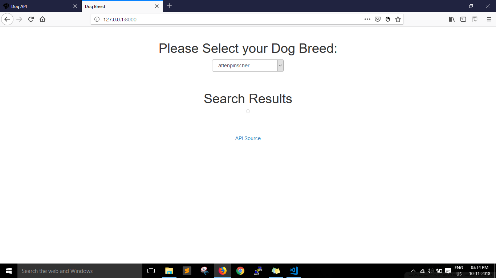
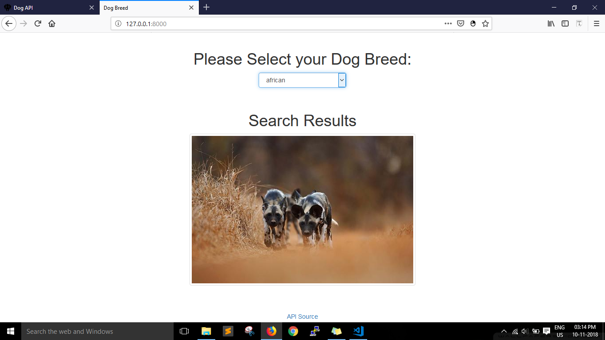
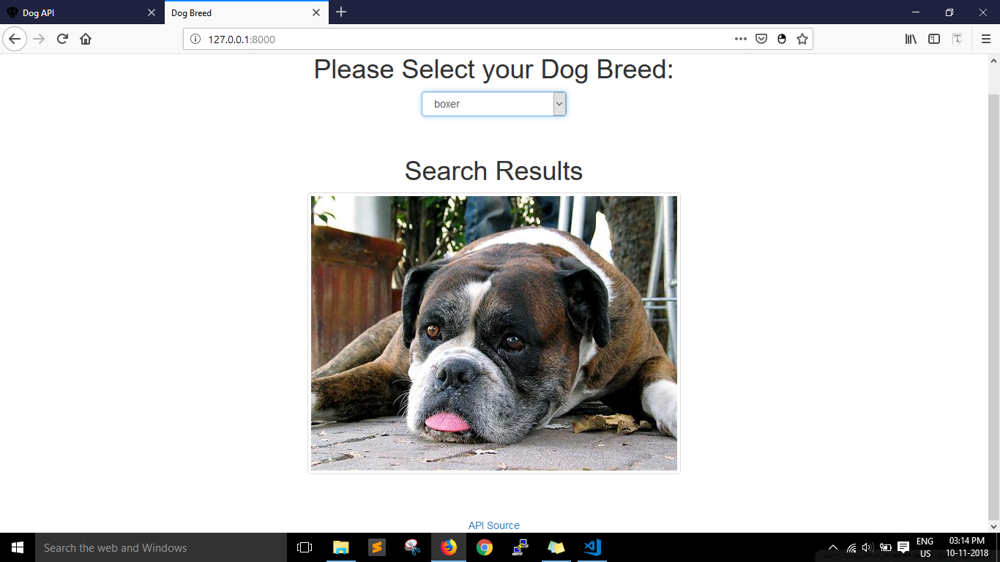
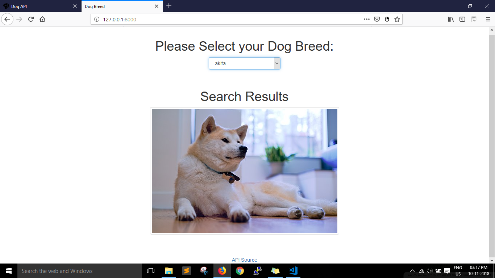

# DogBreed

A website to fetch dog's image based on their breed name.

## Getting Started

These instructions will get you a copy of the project up and running on your local machine for development.

### Prerequisites

* Install the [Python](https://www.python.org/) in your PC.
* Install the [pip](https://pypi.org/project/pip/)

### Installing

A step by step series of examples that tell you how to get a development env running.
* Open the terminal or powershell and go to the project path and type the below command

```

cd holidog

```

```
pip install -r requirements.txt 
  
```

```
python manage.py runserver
```
open the browser and go to http://127.0.0.1:8000/
## Built With

* [Python](https://www.python.org/)  

## Screenshots
 * Main Screen 
   
 * Search Results 1 
   
 * Search Results 2
   
 * Search Results 3
  
  
## Authors

* **Srirama Dheeraj** - [DheerajRam13](https://github.com/dheerajram13/)
